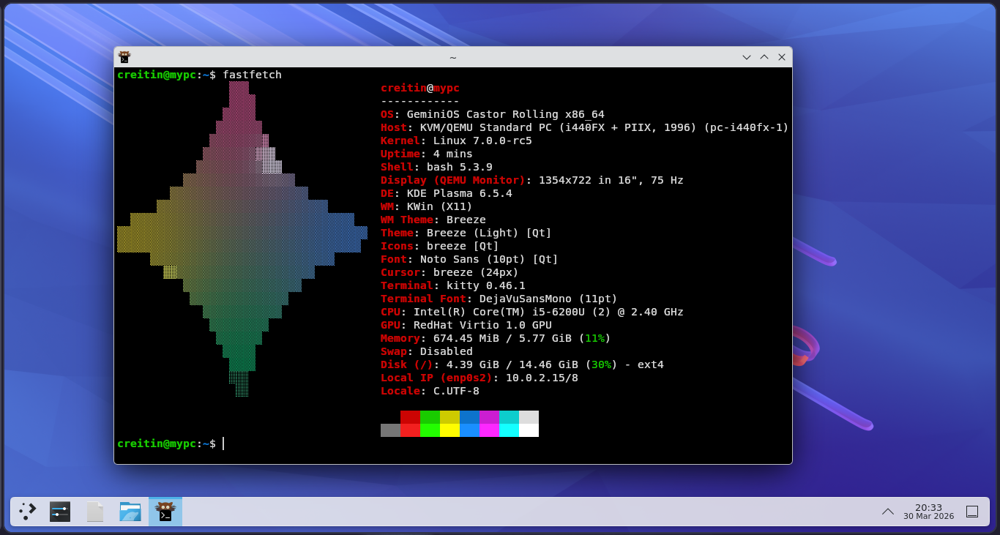

# GeminiOS Documentation

GeminiOS is a minimal, open-source, educational, Debian-derived Linux operating system that does not use `systemd` (initially made by Google Gemini 3, continued by Codex). It also does not rely on build systems like Buildroot.

The project now follows a clear model:

- Debian-derived userland and package ecosystem
- GeminiOS-specific boot flow, init/service model, and packaging workflow
- Debian-native `apt`/`dpkg` package management staged through `apt-src`

Versioning follows a rolling `stream + snapshot` model:

- the named stream is kept in [`src/sys_info.h`](src/sys_info.h) as the human release line.
- each built image gets a UTC snapshot date like `2026.03.23`
- `/etc/os-release` keeps `VERSION_ID="rolling"` and uses `BUILD_ID` / `IMAGE_VERSION` for the exact image snapshot

Started with Google Gemini 3 Pro, let's see how far we can go with that.

## Setup and Build

To build GeminiOS, you need a Linux host (a Debian-based OS is mandatory) with the following dependencies:

*Only tested and built on a Debian 13 Trixie x86_64 system*

```bash
sudo apt install build-essential bison flex libncurses-dev libssl-dev libelf-dev \
                 zlib1g-dev libzstd-dev xorriso qemu-system-x86 git bc wget patch \
                 python3 python3-mako python3-markupsafe mtools grub-pc-bin lz4 \
                 gperf libxcb-keysyms1-dev meson ninja-build squashfs-tools cpio \
                 libxml2-dev libxslt1-dev texinfo intltool gawk valac libapt-pkg-dev help2man
```

Make sure to make the build scripts executable:
```bash
chmod +x ports/**/build.sh
chmod +x build_system/*.sh
```

### Python Environment (Required)

The build system, particularly the Python package build, requires a specific host Python version (3.11) to avoid cross-compilation version mismatches (e.g., building Python 3.11 using a host Python 3.13). We use **pyenv** to ensure the correct version is available.

1.  **Install Prerequisites for Python Build**:
    ```bash
    sudo apt install libreadline-dev libsqlite3-dev libbz2-dev libncurses5-dev libgdbm-dev libnss3-dev libssl-dev libffi-dev liblzma-dev
    ```

2.  **Install pyenv**:
    If you don't have pyenv, install it (or use your distro's package manager):
    ```bash
    curl https://pyenv.run | bash
    # Remember to add the init lines to your shell config (~/.bashrc) as instructed by the installer!
    source ~/.bashrc
    ```

3.  **Install Python 3.11.9**:
    ```bash
    pyenv install 3.11.9
    ```
    *The build scripts are hardcoded to look for `~/.pyenv/versions/3.11.9/bin/python3.11` for critical build steps.*

**Note**: Host Python version > 3.12 may fail due to the removal of the `pipes` and `distutils` modules in some external dependencies (e.g., older GLib/Meson versions). If you encounter issues, consider using a compatibility layer or patching the affected files, though the `builder.py` and `pyenv` should handle this automatically.

### The Shim Wrapper (`build_system/shim_wrapper.c`)
This is the core component that enforces the cross-compilation environment. 
- **What it is**: A small C program compiled into `build_system/shim_wrapper`.
- **How it works**: We create symlinks for standard tools (gcc, g++, ar, etc.) in `build_system/shim/` that all point to this wrapper binary.
- **Runtime Behavior**: When a build script calls `gcc`, it actually calls our wrapper. The wrapper:
  1.  **Sanitizes the Environment**: Unsets `LD_LIBRARY_PATH`, `PYTHONPATH`, etc., to prevent host contamination.
  2.  **Injects Flags**: Automatically adds `--sysroot=/path/to/geminios/rootfs` to compiler arguments.
  3.  **Redirects**: Calls the path to the real cross-compiler or system tool with the modified arguments.

To recompile the wrapper if you modify `shim_wrapper.c`:
```bash
make -C build_system
```

This ensures that every package build automagically targets GeminiOS without requiring every single makefile to be perfectly configured for cross-compilation.

1.  **Run Builder**:
    ```bash
    python3 builder.py
    ```
- If you want to force a rebuild of every package, use the `--force` flag:
    ```bash
    python3 builder.py --force
    ```

- Or if you want to build a specific package, just run:
    ```bash
    python3 builder.py <package_name>
    ```

- You can also force a rebuild of a specific package by using the `--force` flag:
    ```bash
    python3 builder.py <package_name> --force
    ```
- To clean the entire build environment, use the `--clean` flag:
    ```bash
    python3 builder.py --clean
    ```

### GitHub Actions ISO Builds

The repo now includes an automatic ISO workflow at [.github/workflows/build-iso.yml](.github/workflows/build-iso.yml).

- It can be started manually with `workflow_dispatch`.
- It also runs automatically on pushes to `main`.
- The workflow installs the host build dependencies, creates the expected `~/.pyenv/versions/3.11.9` compatibility path, downloads and builds the configured kernel, runs `python3 builder.py`, and uploads the resulting ISO plus build logs as workflow artifacts.

The CI helper logic lives in [`tools/ci_build_iso.sh`](tools/ci_build_iso.sh).

### VM Console Debugging

Recommended QEMU launch:

```bash
qemu-system-x86_64 -cdrom GeminiOS.iso -m 4G -serial stdio -smp 2 -vga std -enable-kvm \
  -nic user,model=e1000
```

- Live/default root password: `geminios`
- Use the serial console for early boot and login debugging; no SSH service is included in the base image.
- The live ISO now defaults to `geminios.live_root=auto`: in VMs with enough RAM it copies `root.sfs` into a fully writable tmpfs root so `dpkg` can safely replace core runtime packages like `libc6`. You can force the mode with `geminios.live_root=copy` or `geminios.live_root=overlay`.

## Development Workflow

- **The Kernel**: The kernel must be compiled before running the main builder.
  See the [Kernel Compilation](#kernel-compilation) section below.

- **Core System (Ginit)**: The initialization system and core utilities reside in the `ginit/` directory. It is built as part of the `geminios_core` port but can be developed independently using its own `Makefile`.

- **Package Management**: The base image currently stages Debian `apt` tooling through [`ports/apt-src/build.sh`](ports/apt-src/build.sh). The top-level `gpkg/` tree is still in the repo for separate work, but it is not currently staged into the built rootfs.

- **Userspace Packages**: Most other system utilities are in `src/packages/` (system utilities).

- **Verification**: The build system now uses a manifest-based verification system (`build_system/package_manifests.json`). If a package build fails or artifacts are missing, the builder will report exactly what is missing.

## Display Stack Status

GeminiOS currently boots and runs a regular X11 desktop session. The base image now includes the Wayland protocol/runtime foundation as part of the graphics stack:

- `wayland` and `wayland-protocols`
- Wayland-enabled `libxkbcommon`
- Wayland-enabled GTK 3
- Mesa built with both `x11` and `wayland` platforms
- Xwayland-capable `xorg-server`
- `libinput` for compositor/input stacks
- `json-glib`, `dconf`, and `xdg-user-dirs`
- session bootstrap helpers in `geminios_core`:
  - `/bin/startwayland`
  - `/bin/wayland-session-report`
  - `/usr/libexec/geminios/session-launch`
  - `/usr/libexec/geminios/session-runtime`

That solves the class of runtime failures caused by packages expecting GTK/Wayland client symbols to exist.
It also means GeminiOS now has a non-`systemd --user` session bootstrap path for imported Wayland desktops: the wrapper starts a session bus when needed, exports the XDG session variables, and opportunistically launches common user daemons such as PipeWire, portals, polkit agents, `at-spi`, and `gnome-keyring` if those packages are installed later from Debian packages.
The base login/session layer now also seeds the standard XDG home directories, infers the runtime D-Bus socket when one already exists, and supports shell drop-ins under `/usr/libexec/geminios/session-env.d`, `/etc/geminios/session-env.d`, and `$HOME/.config/geminios/session-env.d` so future Wayland packages can extend the session environment without patching `geminios_core` again.

What it does **not** mean yet:

- GeminiOS does not ship a Wayland compositor in-tree, but you can install one later with `apt`.
- The default desktop/session flow is still X11 unless you explicitly start a Wayland session.

So the current state is: **Wayland-capable userspace foundation plus a real session bootstrap path, but the compositor still need to be installed on top.**

Once a compositor package is installed, the intended manual smoke-test flow from a TTY is:

```bash
wayland-session-report
startweston
startwayland <compositor-command>
```

`wayland-session-report` is the quick sanity check before launching a compositor: it reports the current XDG session environment, runtime sockets, DRM/input device visibility, and whether `Xwayland`, portals, PipeWire binaries are already installed.
Those wrappers are the supported bridge between GeminiOS login/PAM/elogind and imported desktop packages that normally expect `dbus-run-session` plus `systemd --user`-style session setup.

## Package Sources

The current GeminiOS image stages Debian package management through the `apt-src` port.
That means the built rootfs ships Debian `apt`, `apt-utils`, `gpgv`, the Debian archive keyring, and a standard `dpkg` state layout instead of the older staged `gpkg` runtime.

The default image seeds:

- `/etc/apt/sources.list`: the Debian testing source generated from `build_system/gpkg_debian.conf`
- `/etc/apt/apt.conf.d/99geminios-debian.conf`: GeminiOS apt defaults
- `/var/repo/debian/Packages` and `/var/repo/debian/Packages.gz`: cached Debian index copies used by the build
- `/usr/share/keyrings/debian-archive-keyring.gpg`: Debian archive keyring used for signed repository verification

Typical flow inside GeminiOS:

```bash
sudo apt update
apt search nano
apt show nano
sudo apt install nano
sudo apt install weston
```

Important:

- The staged image currently expects Debian testing to be the primary package source.
- `apt-src` is the integration point that populates the runtime apt layout in the image.
- The build no longer stages `/etc/gpkg`, `/usr/share/gpkg`, or `/var/lib/gpkg` into the final rootfs.
- The `gpkg/` tree still exists in the repo for development, but it is not the package manager shipped in the current image.

GeminiOS also ships a system-wide `fastfetch` default at `/etc/xdg/fastfetch/config.jsonc`, with GeminiOS logo assets under `/usr/share/fastfetch/logos/`. Users can still override that per-account with `~/.config/fastfetch/config.jsonc`.

## Ginit (Init System)

Ginit is modularized for easier development. It provides `ginit`, `login`, and `getty`, while `/sbin/init` remains only as the boot entrypoint.
To build it manually:
```bash
cd ginit && make
```
For more information, see [ginit/README.md](https://github.com/CreitinGameplays/ginit/blob/master/README.md).

## Legacy GPKG

The top-level `gpkg/` tree is now a standalone or experimental package-manager source tree, not the package manager staged into the default GeminiOS image.

If you want to build it manually for local experimentation:

```bash
cd gpkg && make
```

To install it into a separate rootfs manually:

```bash
cd gpkg && make install DESTDIR=/path/to/rootfs
```

The current builder no longer stages `gpkg`, `/etc/gpkg`, `/usr/share/gpkg`, or `/var/lib/gpkg` into the final image by default.

## Build System Architecture

GeminiOS uses a custom "Shim Wrapper" architecture to ensure build isolation and correct cross-compilation without needing a complex chroot setup during the build phase.

## Kernel Compilation

Run these commands once to prepare the kernel:
```sh
mkdir -p external_dependencies
cd external_dependencies
# Download kernel
wget https://cdn.kernel.org/pub/linux/kernel/v6.x/linux-6.19.10.tar.xz
tar -xf linux-6.19.10.tar.xz
rm linux-6.19.10.tar.xz
cd linux-6.19.10

# 1. Start from the upstream x86_64 default config
make x86_64_defconfig

# 2. Required GeminiOS boot, console and VM graphics support
./scripts/config --enable CONFIG_FB
./scripts/config --enable CONFIG_FB_VESA
./scripts/config --enable CONFIG_FB_EFI
./scripts/config --enable CONFIG_DRM
./scripts/config --enable CONFIG_DRM_KMS_HELPER
./scripts/config --enable CONFIG_DRM_SIMPLEDRM
./scripts/config --enable CONFIG_DRM_BOCHS
./scripts/config --enable CONFIG_DRM_VIRTIO_GPU
./scripts/config --enable CONFIG_FRAMEBUFFER_CONSOLE
./scripts/config --enable CONFIG_DRM_FBDEV_EMULATION
./scripts/config --set-val CONFIG_DRM_FBDEV_OVERALLOC 100
./scripts/config --enable CONFIG_INPUT_EVDEV

# 3. Required GeminiOS live ISO and rootfs support
./scripts/config --enable CONFIG_SQUASHFS
./scripts/config --enable CONFIG_SQUASHFS_ZSTD
./scripts/config --enable CONFIG_SQUASHFS_XZ
./scripts/config --enable CONFIG_OVERLAY_FS
./scripts/config --enable CONFIG_BLK_DEV_LOOP
./scripts/config --enable CONFIG_ISO9660_FS
./scripts/config --enable CONFIG_DEVTMPFS
./scripts/config --enable CONFIG_DEVTMPFS_MOUNT
./scripts/config --enable CONFIG_TMPFS
./scripts/config --enable CONFIG_MSDOS_PARTITION
./scripts/config --enable CONFIG_EFI_PARTITION
./scripts/config --enable CONFIG_EXT4_FS
./scripts/config --enable CONFIG_EXT4_USE_FOR_EXT2

# 4. Required SELinux, audit and label/xattr support
./scripts/config --enable CONFIG_SECURITY
./scripts/config --enable CONFIG_SECURITYFS
./scripts/config --enable CONFIG_AUDIT
./scripts/config --enable CONFIG_AUDITSYSCALL
./scripts/config --enable CONFIG_NETLABEL
./scripts/config --enable CONFIG_DEFAULT_SECURITY_SELINUX
./scripts/config --disable CONFIG_DEFAULT_SECURITY_DAC
./scripts/config --enable CONFIG_SECURITY_SELINUX
./scripts/config --enable CONFIG_SECURITY_SELINUX_BOOTPARAM
./scripts/config --set-val CONFIG_SECURITY_SELINUX_BOOTPARAM_VALUE 1
./scripts/config --enable CONFIG_SECURITY_SELINUX_DEVELOP
./scripts/config --enable CONFIG_SECURITY_SELINUX_AVC_STATS
./scripts/config --enable CONFIG_EXT4_FS_SECURITY
./scripts/config --enable CONFIG_XFS_FS
./scripts/config --enable CONFIG_XFS_POSIX_ACL
./scripts/config --enable CONFIG_BTRFS_FS

# 5. Optional but strongly recommended filesystem support
# Use =y for simpler live media behavior when possible.
./scripts/config --enable CONFIG_FUSE_FS
./scripts/config --enable CONFIG_CUSE
./scripts/config --enable CONFIG_VFAT_FS
./scripts/config --enable CONFIG_EXFAT_FS
./scripts/config --enable CONFIG_NTFS3_FS
./scripts/config --enable CONFIG_F2FS_FS
./scripts/config --enable CONFIG_UDF_FS
./scripts/config --enable CONFIG_EXT4_FS_POSIX_ACL
./scripts/config --enable CONFIG_BTRFS_FS_POSIX_ACL
./scripts/config --enable CONFIG_TMPFS_POSIX_ACL
./scripts/config --enable CONFIG_FS_POSIX_ACL
./scripts/config --enable CONFIG_AUTOFS_FS

# 6. Optional but strongly recommended storage and removable media support
./scripts/config --enable CONFIG_ATA
./scripts/config --enable CONFIG_SATA_AHCI
./scripts/config --enable CONFIG_SCSI
./scripts/config --enable CONFIG_BLK_DEV_SD
./scripts/config --enable CONFIG_CHR_DEV_SG
./scripts/config --enable CONFIG_NVME_CORE
./scripts/config --enable CONFIG_BLK_DEV_NVME
./scripts/config --enable CONFIG_USB_STORAGE
./scripts/config --enable CONFIG_MMC
./scripts/config --enable CONFIG_MMC_BLOCK
./scripts/config --enable CONFIG_DM_CRYPT
./scripts/config --enable CONFIG_MD
./scripts/config --enable CONFIG_BLK_DEV_DM

# 7. Optional but strongly recommended desktop/laptop input support
./scripts/config --enable CONFIG_INPUT_KEYBOARD
./scripts/config --enable CONFIG_INPUT_MOUSE
./scripts/config --enable CONFIG_INPUT_TOUCHSCREEN
./scripts/config --enable CONFIG_HID
./scripts/config --enable CONFIG_HID_GENERIC
./scripts/config --enable CONFIG_HID_MULTITOUCH
./scripts/config --enable CONFIG_I2C_HID
./scripts/config --enable CONFIG_I2C_HID_ACPI
./scripts/config --enable CONFIG_SERIO
./scripts/config --enable CONFIG_SERIO_I8042
./scripts/config --enable CONFIG_LEGACY_PTYS

# 8. Optional but strongly recommended desktop graphics support
./scripts/config --enable CONFIG_AGP
./scripts/config --enable CONFIG_BACKLIGHT_CLASS_DEVICE
./scripts/config --enable CONFIG_DRM_AMDGPU
./scripts/config --enable CONFIG_DRM_RADEON
./scripts/config --enable CONFIG_DRM_I915
./scripts/config --enable CONFIG_DRM_NOUVEAU
./scripts/config --enable CONFIG_FB_SIMPLE

# 9. Optional but strongly recommended audio support
./scripts/config --enable CONFIG_SOUND
./scripts/config --enable CONFIG_SND
./scripts/config --enable CONFIG_SND_HDA_INTEL
./scripts/config --enable CONFIG_SND_HDA_CODEC_HDMI
./scripts/config --enable CONFIG_SND_USB_AUDIO
./scripts/config --enable CONFIG_SND_HRTIMER
./scripts/config --enable CONFIG_SND_SEQ
./scripts/config --enable CONFIG_SND_TIMER

# 10. Optional but strongly recommended networking support
./scripts/config --enable CONFIG_PACKET
./scripts/config --enable CONFIG_UNIX
./scripts/config --enable CONFIG_INET
./scripts/config --enable CONFIG_IPV6
./scripts/config --enable CONFIG_CFG80211
./scripts/config --enable CONFIG_MAC80211
./scripts/config --enable CONFIG_RFKILL
./scripts/config --enable CONFIG_WLAN
./scripts/config --enable CONFIG_BT
./scripts/config --enable CONFIG_BT_BREDR
./scripts/config --enable CONFIG_BT_RFCOMM
./scripts/config --enable CONFIG_BT_HIDP

# 11. Optional but strongly recommended common USB and peripheral support
./scripts/config --enable CONFIG_USB_SUPPORT
./scripts/config --enable CONFIG_USB_XHCI_HCD
./scripts/config --enable CONFIG_USB_EHCI_HCD
./scripts/config --enable CONFIG_USB_OHCI_HCD
./scripts/config --enable CONFIG_USB_HID
./scripts/config --enable CONFIG_USB_UAS
./scripts/config --enable CONFIG_TYPEC
./scripts/config --enable CONFIG_TYPEC_UCSI
./scripts/config --enable CONFIG_UCSI_ACPI

# 12. Optional but strongly recommended power, thermal and laptop support
./scripts/config --enable CONFIG_ACPI
./scripts/config --enable CONFIG_ACPI_BATTERY
./scripts/config --enable CONFIG_ACPI_BUTTON
./scripts/config --enable CONFIG_ACPI_VIDEO
./scripts/config --enable CONFIG_CPU_FREQ
./scripts/config --enable CONFIG_CPU_FREQ_DEFAULT_GOV_SCHEDUTIL
./scripts/config --enable CONFIG_CPU_IDLE
./scripts/config --enable CONFIG_THERMAL
./scripts/config --enable CONFIG_THERMAL_HWMON
./scripts/config --enable CONFIG_HW_RANDOM

# 13. Optional but strongly recommended virtualization and VM guest support
./scripts/config --enable CONFIG_VIRTIO
./scripts/config --enable CONFIG_VIRTIO_PCI
./scripts/config --enable CONFIG_VIRTIO_BLK
./scripts/config --enable CONFIG_VIRTIO_NET
./scripts/config --enable CONFIG_VIRTIO_INPUT
./scripts/config --enable CONFIG_VIRTIO_CONSOLE
./scripts/config --enable CONFIG_VSOCKETS
./scripts/config --enable CONFIG_HYPERV
./scripts/config --enable CONFIG_HYPERV_STORAGE
./scripts/config --enable CONFIG_HYPERV_NET
./scripts/config --enable CONFIG_PARAVIRT

# 14. Optional but strongly recommended container / modern userspace support
./scripts/config --enable CONFIG_NAMESPACES
./scripts/config --enable CONFIG_UTS_NS
./scripts/config --enable CONFIG_IPC_NS
./scripts/config --enable CONFIG_PID_NS
./scripts/config --enable CONFIG_NET_NS
./scripts/config --enable CONFIG_CGROUPS
./scripts/config --enable CONFIG_CGROUP_FREEZER
./scripts/config --enable CONFIG_CGROUP_DEVICE
./scripts/config --enable CONFIG_CGROUP_PIDS
./scripts/config --enable CONFIG_MEMCG
./scripts/config --enable CONFIG_BPF
./scripts/config --enable CONFIG_BPF_SYSCALL

# 15. Finalize and compile
make olddefconfig
make -j$(nproc) bzImage
```

Notes:

- The blocks above are split into `required` and `optional but strongly recommended`.
- GeminiOS can boot with a smaller kernel, but the optional blocks make it much more likely to work on real laptops, desktops, VMs and removable media without rebuilding the kernel again later.
- For boot-critical features such as live ISO filesystems, root storage, basic display, input and `/dev/fuse`, prefer `=y` over `=m` unless you already have a reliable module-loading path.
- `CONFIG_FUSE_FS=y` is the simplest way to avoid `/dev/fuse not found` issues during desktop sessions.

Recommended verification before returning to `builder.py`:

```sh
grep -E 'CONFIG_SECURITY_SELINUX=|CONFIG_DEFAULT_SECURITY_SELINUX=|CONFIG_SECURITYFS=|CONFIG_EXT4_FS_SECURITY=|CONFIG_FUSE_FS=|CONFIG_SQUASHFS=|CONFIG_OVERLAY_FS=|CONFIG_DRM_SIMPLEDRM=|CONFIG_VIRTIO_GPU=|CONFIG_NVME_CORE=|CONFIG_SND_HDA_INTEL=' .config
```

Expected result:

- `CONFIG_SECURITY_SELINUX=y`
- `CONFIG_DEFAULT_SECURITY_SELINUX=y`
- `CONFIG_SECURITYFS=y`
- `CONFIG_EXT4_FS_SECURITY=y`
- `CONFIG_FUSE_FS=y`
- `CONFIG_SQUASHFS=y`
- `CONFIG_OVERLAY_FS=y`
- `CONFIG_DRM_SIMPLEDRM=y`

Optional but good signs:

- `CONFIG_VIRTIO_GPU=y`
- `CONFIG_NVME_CORE=y`
- `CONFIG_SND_HDA_INTEL=y`

GeminiOS keeps `/etc/selinux/config` in the base rootfs with `SELINUX=disabled`.
The live ISO currently boots with `selinux=0`, and the installer writes installed systems with `SELINUX=disabled` by default.

## Kernel Packages

GeminiOS now has a structured path for shipping kernels as native `.gpkg` packages from your own repository, instead of mixing them into the Debian importer.

The intended layout follows the same general shape Debian uses for kernels:

- a versioned image package, for example `geminios-kernel-image-6.19.10`
- an optional channel/meta package, for example `geminios-kernel-stable` or `geminios-kernel-mainline`
- a public repository index under `x86_64/Packages.json.zst`

The release defaults live in:

```text
build_system/kernel_package_channels.json
build_system/gpkg_default_sources.list
```

`tools/build_kernel_gpkg.py` generates SDK-compatible package source trees, builds `.gpkg` archives through the GeminiOS SDK, and can refresh a repository index in one pass.

Typical flow:

```bash
# 1. Build the kernel and modules
cd external_dependencies/linux-6.19.10
make -j"$(nproc)" bzImage modules
rm -rf /tmp/geminios-kernel-stage
make modules_install INSTALL_MOD_PATH=/tmp/geminios-kernel-stage

# 2. Build GeminiOS kernel packages
cd /home/creitin/Documents/geminios
python3 tools/build_kernel_gpkg.py \
  --kernel-release "$(make -s -C external_dependencies/linux-6.19.10 kernelrelease)" \
  --bzimage external_dependencies/linux-6.19.10/arch/x86/boot/bzImage \
  --modules-dir /tmp/geminios-kernel-stage/lib/modules/"$(make -s -C external_dependencies/linux-6.19.10 kernelrelease)" \
  --config-file external_dependencies/linux-6.19.10/.config \
  --channel stable \
  --repo-root /tmp/geminios-kernel-repo

# 3. Publish /tmp/geminios-kernel-repo/x86_64 to your bucket or custom domain
```

What the tool does:

- builds a versioned package that installs `/boot/kernel-<release>` and `lib/modules/<release>/...`
- adds maintainer scripts that repoint `/boot/kernel` to the installed version
- optionally builds a channel/meta package like `geminios-kernel-stable`
- optionally copies the packages into `<repo-root>/x86_64/<subdir>/` and refreshes `Packages.json.zst`

That keeps GeminiOS boot compatibility intact today, because the installer and GRUB config still use `/boot/kernel`, while letting the repository behave more like an apt-managed kernel channel.

---

### Patch System

GeminiOS uses a centralized patch system. Manual fixes for external dependencies are stored as `.patch` files in the `patches/` directory and are automatically applied by the respective build scripts in `ports/`.

Current patches included:
- `libffi-3.4.4.patch`: Fixes trampoline execution for Linux/Cygwin.
- `gobject-introspection-1.78.1-msvc.patch`: Fixes `MSVCCompiler` import issues.
- `libXrender-0.9.11-glyph.patch`: Fixes glyph allocation in XRender.
- `xorg-server-1.20.14-glxdri2.patch`: Fixes `bool` type conflict in GLX DRI2.

---
