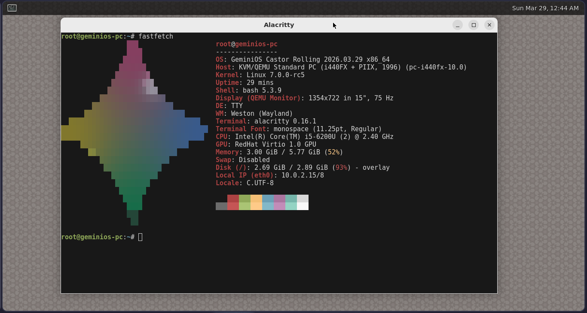

# GeminiOS Documentation

GeminiOS is a minimal, open-source, educational, Debian-compatible Linux operating system built from scratch (initially made by Google Gemini 3, continued by Codex). It does not rely on build systems like Buildroot.

The project now follows a clear model:

- Debian-compatible userland and package ecosystem
- GeminiOS-specific boot flow, init/service model, and packaging workflow
- `gpkg` as a testing-first package manager with GeminiOS/S2 packages layered on top

Versioning follows a rolling `stream + snapshot` model:

- the named stream is kept in [`src/sys_info.h`](/home/creitin/Documents/geminios/src/sys_info.h) as the human release line.
- each built image gets a UTC snapshot date like `2026.03.23`
- `/etc/os-release` keeps `VERSION_ID="rolling"` and uses `BUILD_ID` / `IMAGE_VERSION` for the exact image snapshot

Started with Google Gemini 3 Pro, let's see how far we can go with that.

## Setup and Build

To build GeminiOS, you need a Linux host (Ubuntu/Debian highly recommended) with the following dependencies:

*Only tested and built on a Debian 13 Trixie x86_64 system*

```bash
sudo apt install build-essential bison flex libncurses-dev libssl-dev libelf-dev \
                 zlib1g-dev libzstd-dev xorriso qemu-system-x86 git bc wget patch \
                 python3 python3-mako python3-markupsafe mtools grub-pc-bin lz4 \
                 gperf libxcb-keysyms1-dev meson ninja-build squashfs-tools cpio \
                 libxml2-dev libxslt1-dev texinfo intltool valac
```

Make sure to make the build scripts executable:
```bash
chmod +x ports/**/build.sh
chmod +x build_system/*.sh
```

### Python Environment (Required)

The build system, particularly the Python package build, requires a specific host Python version (3.11) to avoid cross-compilation version mismatches (e.g., building Python 3.11 using a host Python 3.13). We use **pyenv** to ensure the correct version is available.

1.  **Install Prerequisites for Python Build**:
    ```bash
    sudo apt install libreadline-dev libsqlite3-dev libbz2-dev libncurses5-dev libgdbm-dev libnss3-dev libssl-dev libffi-dev liblzma-dev
    ```

2.  **Install pyenv**:
    If you don't have pyenv, install it (or use your distro's package manager):
    ```bash
    curl https://pyenv.run | bash
    # Remember to add the init lines to your shell config (~/.bashrc) as instructed by the installer!
    source ~/.bashrc
    ```

3.  **Install Python 3.11.9**:
    ```bash
    pyenv install 3.11.9
    ```
    *The build scripts are hardcoded to look for `~/.pyenv/versions/3.11.9/bin/python3.11` for critical build steps.*

**Note**: Host Python version > 3.12 may fail due to the removal of the `pipes` and `distutils` modules in some external dependencies (e.g., older GLib/Meson versions). If you encounter issues, consider using a compatibility layer or patching the affected files, though the `builder.py` and `pyenv` should handle this automatically.

### The Shim Wrapper (`build_system/shim_wrapper.c`)
This is the core component that enforces the cross-compilation environment. 
- **What it is**: A small C program compiled into `build_system/shim_wrapper`.
- **How it works**: We create symlinks for standard tools (gcc, g++, ar, etc.) in `build_system/shim/` that all point to this wrapper binary.
- **Runtime Behavior**: When a build script calls `gcc`, it actually calls our wrapper. The wrapper:
  1.  **Sanitizes the Environment**: Unsets `LD_LIBRARY_PATH`, `PYTHONPATH`, etc., to prevent host contamination.
  2.  **Injects Flags**: Automatically adds `--sysroot=/path/to/geminios/rootfs` to compiler arguments.
  3.  **Redirects**: Calls the path to the real cross-compiler or system tool with the modified arguments.

To recompile the wrapper if you modify `shim_wrapper.c`:
```bash
make -C build_system
```

This ensures that every package build automagically targets GeminiOS without requiring every single makefile to be perfectly configured for cross-compilation.

1.  **Run Builder**:
    ```bash
    python3 builder.py
    ```
- If you want to force a rebuild of every package, use the `--force` flag:
    ```bash
    python3 builder.py --force
    ```

- Or if you want to build a specific package, just run:
    ```bash
    python3 builder.py <package_name>
    ```

- You can also force a rebuild of a specific package by using the `--force` flag:
    ```bash
    python3 builder.py <package_name> --force
    ```
- To clean the entire build environment, use the `--clean` flag:
    ```bash
    python3 builder.py --clean
    ```

## Development Workflow

- **The Kernel**: The kernel must be compiled before running the main builder.
  See the [Kernel Compilation](#kernel-compilation) section below.

- **Core System (Ginit)**: The initialization system and core utilities reside in the `ginit/` directory. It is built as part of the `geminios_core` port but can be developed independently using its own `Makefile`.

- **Package Manager (GPKG)**: The package manager now lives in the top-level `gpkg/` directory, with its own `src/`, `README`, and `Makefile`. It is integrated into the OS through the `geminios_complex` port, but can also be built independently.

- **Userspace Packages**: Most other system utilities are in `packages/` (system utilities).

- **Verification**: The build system now uses a manifest-based verification system (`build_system/package_manifests.json`). If a package build fails or artifacts are missing, the builder will report exactly what is missing.

## Display Stack Status

GeminiOS currently boots and runs a regular X11 desktop session. The base image now includes the Wayland protocol/runtime foundation as part of the graphics stack:

- `wayland` and `wayland-protocols`
- Wayland-enabled `libxkbcommon`
- Wayland-enabled GTK 3
- Mesa built with both `x11` and `wayland` platforms
- Xwayland-capable `xorg-server`
- `libinput` for compositor/input stacks
- `json-glib`, `dconf`, and `xdg-user-dirs` as core GNOME-facing session prerequisites
- session bootstrap helpers in `geminios_core`:
  - `/bin/startwayland`
  - `/bin/startweston`
  - `/bin/startgnome-wayland`
  - `/bin/wayland-session-report`
  - `/usr/libexec/geminios/session-launch`
  - `/usr/libexec/geminios/session-runtime`

That solves the class of runtime failures caused by packages expecting GTK/Wayland client symbols to exist.
It also means GeminiOS now has a non-`systemd --user` session bootstrap path for imported Wayland desktops: the wrapper starts a session bus when needed, exports the XDG session variables, and opportunistically launches common user daemons such as PipeWire, portals, polkit agents, `at-spi`, and `gnome-keyring` if those packages are installed later via `.gpkg`.
The base login/session layer now also seeds the standard XDG home directories, infers the runtime D-Bus socket when one already exists, and supports shell drop-ins under `/usr/libexec/geminios/session-env.d`, `/etc/geminios/session-env.d`, and `$HOME/.config/geminios/session-env.d` so future Wayland/GNOME packages can extend the session environment without patching `geminios_core` again.

What it does **not** mean yet:

- GeminiOS does not ship a Wayland compositor in-tree, but you can install any with `gpkg`.
- The default desktop/session flow is still X11 unless you explicitly start a Wayland session.

So the current state is: **Wayland-capable userspace foundation plus a real session bootstrap path, but the compositor still need to be installed on top.**

Once a compositor package is installed, the intended manual smoke-test flow from a TTY is:

```bash
wayland-session-report
startweston
startwayland <compositor-command>
startgnome-wayland
```

`wayland-session-report` is the quick sanity check before launching a compositor: it reports the current XDG session environment, runtime sockets, DRM/input device visibility, and whether `Xwayland`, portals, PipeWire binaries are already installed.
Those wrappers are the supported bridge between GeminiOS login/PAM/elogind and imported desktop packages that normally expect `dbus-run-session` plus `systemd --user`-style session setup.

## Package Sources

`gpkg` now uses Debian testing as its primary package source and merges that metadata with any configured GeminiOS/S2 `.gpkg` repositories.

The default image seeds:

- `/etc/gpkg/debian.conf`: built-in Debian testing backend configuration
- `/etc/gpkg/import-policy.json`: testing import blocklist, dependency/provider policy, and base-system ownership rules
- `/etc/gpkg/sources.list.d/*.list`: optional secondary `.gpkg` repositories, with defaults taken from `build_system/gpkg_default_sources.list`

Debian testing is the main source for `search`, `show`, `install`, and `upgrade`.
Public `.gpkg` repositories are still supported for GeminiOS-native packages such as `gpkg`, `gtop`, and other curated packages that are not available from testing.

If you published `.gpkg` files to a public bucket or custom domain, `gpkg` can consume that repository directly as a secondary source. The repository base URL should point to the directory that contains the `x86_64/` folder. For example, if your index is at `https://repo.creitingameplays.com/x86_64/Packages.json.zst`, the repository URL to add is:

```text
https://repo.creitingameplays.com
```

`gpkg add-repo` now normalizes URLs, so it also accepts inputs ending in `/x86_64` or `/x86_64/Packages.json.zst`.

Typical flow inside GeminiOS:

```bash
gpkg list-repos
sudo gpkg update
gpkg show nano
gpkg search nano
sudo gpkg install nano
sudo gpkg add-repo https://repo.creitingameplays.com
```

What each step verifies:
- `gpkg list-repos`: Shows the built-in Debian testing backend plus any configured S2 repos.
- `gpkg update`: Downloads and merges Debian testing metadata with all configured `.gpkg` repository indices.
- `gpkg show <pkg>`: Displays the selected candidate, its source kind, origin URL, and dependency list.
- `gpkg search <query>`: Searches the merged local cache and shows where the chosen candidate comes from.
- `gpkg install <pkg>`: Downloads either a `.gpkg` from S2 or a `.deb` from testing, converts testing packages to `.gpkg`, and installs the prepared archive.
- `gpkg install <pkg> --reinstall`: Forces a reinstall of the selected repository package even when the same version is already installed.
- `gpkg add-repo ...`: Validates that the remote `Packages.json.zst` exists and is readable before adding it as a secondary source.

Manual configuration is also supported by writing one repository URL per line into:

```text
/etc/gpkg/sources.list
/etc/gpkg/sources.list.d/*.list
```

Important:
- Debian testing is configured through `/etc/gpkg/debian.conf`; the v1 default backend is `main/binary-amd64`.
- The testing importer is intentionally policy-limited by `/etc/gpkg/import-policy.json`; packages such as `apt`, `linux-image-*`, bootloader/init packages, and other protected base packages are not installable through testing import.
- The bucket must be publicly readable, or be exposed through a public custom domain, because `gpkg` currently performs plain HTTP(S) fetches.
- Secondary `.gpkg` repositories must still expose `x86_64/Packages.json.zst` and the package files referenced by that index underneath the same base URL.
- `gpkg update` merges Debian testing metadata and multiple `.gpkg` repositories into one local cache instead of overwriting previous sources.
- `gpkg` reads `system_provides` and `upgradeable_system` from `/etc/gpkg/import-policy.json` during dependency resolution so GeminiOS can keep control over base/runtime ownership.

Per-transaction optional dependency control is also available for testing-backed installs, upgrades, and repairs:

```bash
sudo gpkg install fastfetch --recommended-no
sudo gpkg install python3 --reinstall
sudo gpkg upgrade --recommended-yes
sudo gpkg upgrade --reinstall
sudo gpkg repair --suggested-yes
```

GeminiOS also ships a system-wide `fastfetch` default at `/etc/xdg/fastfetch/config.jsonc`, with GeminiOS logo assets under `/usr/share/fastfetch/logos/`. Users can still override that per-account with `~/.config/fastfetch/config.jsonc`.

`--recommended-yes` / `--recommended-no` override Debian `Recommends` handling for the current transaction, and `--suggested-yes` / `--suggested-no` do the same for `Suggests`. `--reinstall` is valid with `install` and `upgrade`; it forces the selected transaction targets back through download/prepare/install even when the installed version is already current. Without those flags, `gpkg` follows the package policy stored in the merged metadata.

`gpkg` now also maintains a dpkg-style status ledger at `/var/lib/gpkg/status` alongside `/var/lib/gpkg/info/`. Installations transition through `half-installed`, `unpacked`, `half-configured`, and `installed`; removals keep package conffiles and land in `config-files`; `gpkg remove --purge` follows the remove step with a purge step that deletes retained conffiles and the remaining package metadata; and retirements forget the package entry entirely after success. The worker restores the previous status automatically if a transaction rolls back.

`gpkg remove` and `gpkg remove --purge` now follow apt/dpkg-style semantics more closely:

- `gpkg remove <pkg>` removes package payload files but keeps retained `/etc` conffiles for that package.
- `gpkg remove <pkg> --purge` removes the package and then purges the retained conffiles and purge-time metadata.
- `gpkg remove <pkg> --autoremove` removes newly unneeded dependency packages.
- `gpkg remove <pkg> --autoremove --purge` removes the package set and purges their retained conffiles too.

`gpkg clean` clears the local package cache under `/var/repo/`: cached `.deb` archives, cached `.gpkg` archives, converted Debian-to-`.gpkg` imports, partial downloads, and merged/package-list indices. That makes it behave closer to `apt` archive cleanup while still resetting gpkg’s merged repository cache in one step.

On SELinux-enabled installs, `gpkg-worker` now relabels the files it just wrote before finishing the transaction, and it drops `/.autorelabel` automatically if an upgrade touches the SELinux policy store itself. GeminiOS also blocks Debian-imported SELinux userspace/policy packages from replacing the distro-managed SELinux stack through normal `gpkg upgrade` runs.

`gpkg doctor` provides a read-only health report for the package manager state. It checks repository/index availability, installed-package metadata consistency, base-system registry drift, and whether `gpkg upgrade` can build a safe dry-run transaction plan.

`builder.py` now seeds `/etc/gpkg/sources.list.d/00-default.list` from `build_system/gpkg_default_sources.list` when that file exists.
That keeps the default GeminiOS-native repository policy in build config instead of hardcoding it into `gpkg` itself.

The default Debian backend config is taken from `build_system/gpkg_debian.conf` and copied into the image as:

```text
/etc/gpkg/debian.conf
```

The default import policy is taken from `build_system/gpkg_import_policy.json` and copied into the image as:

```text
/etc/gpkg/import-policy.json
```

The default secondary repository list is taken from `build_system/gpkg_default_sources.list` and copied into the image as:

```text
/etc/gpkg/sources.list.d/00-default.list
```

That policy file is shared with the Debian import/publisher tooling so the testing importer and the optional bulk publisher use the same blocklist, dependency-choice, provider-choice, rewrite defaults, and base-runtime ownership lists.

## Ginit (Init System)

Ginit is modularized for easier development. It provides `init`, `login`, and `getty`.
To build it manually:
```bash
cd ginit && make
```
For more information, see [ginit/README.md](https://github.com/CreitinGameplays/ginit/blob/master/README.md).

## GPKG (Package Manager)

`gpkg` keeps its base-system knowledge in `/etc/gpkg/import-policy.json`:

- `system_provides`: packages or capabilities GeminiOS should treat as already present
- `upgradeable_system`: base runtimes that may exist in the image, but should still be upgraded from the repository when a newer compatible package exists

This split is important for a testing-first Debian-compatible userland. It avoids treating every base library as permanently frozen while still letting GeminiOS keep control over its own boot and init policy.
When a transaction pulls in one of those upgradeable runtime packages, `gpkg` also expands the configured companion stack for already-present or base-provided runtime peers (for example `libc6` pulling in `libc-bin`, but not the libc development stack during a normal app install) and verifies the live runtime aliases before committing the install, so partial base-library upgrades are rolled back instead of being left half-applied.
GeminiOS now uses Debian-native multiarch as the canonical runtime layout: package-owned shared libraries live under `/lib/x86_64-linux-gnu` and `/usr/lib/x86_64-linux-gnu`. The legacy `/lib64` and `/usr/lib64` paths are compatibility symlinks so older tooling and manifests continue to resolve during the transition.
Before running `ldconfig`, `gpkg-worker` reconciles those canonical and compatibility runtime families using installed-package ownership as the source of truth: owned valid Debian-layout payloads win, compatibility copies are demoted to aliases, and invalid orphaned runtime entries are discarded. The normal `ldconfig` trigger path goes through that same worker repair step, so post-install trigger processing and direct runtime transactions use the same recovery logic.

To build the package manager standalone:

```bash
cd gpkg && make
```

To install it into a rootfs:

```bash
cd gpkg && make install DESTDIR=/path/to/rootfs
```

## Build System Architecture

GeminiOS uses a custom "Shim Wrapper" architecture to ensure build isolation and correct cross-compilation without needing a complex chroot setup during the build phase.

## Kernel Compilation

Run these commands once to prepare the kernel:
```sh
mkdir -p external_dependencies
cd external_dependencies
# Download kernel
wget https://cdn.kernel.org/pub/linux/kernel/v6.x/linux-6.19.10.tar.xz
tar -xf linux-6.19.10.tar.xz
rm linux-6.19.10.tar.xz
cd linux-6.19.10

# 1. Start from the upstream x86_64 default config
make x86_64_defconfig

# 2. Required GeminiOS boot, console and VM graphics support
./scripts/config --enable CONFIG_FB
./scripts/config --enable CONFIG_FB_VESA
./scripts/config --enable CONFIG_FB_EFI
./scripts/config --enable CONFIG_DRM
./scripts/config --enable CONFIG_DRM_KMS_HELPER
./scripts/config --enable CONFIG_DRM_SIMPLEDRM
./scripts/config --enable CONFIG_DRM_BOCHS
./scripts/config --enable CONFIG_DRM_VIRTIO_GPU
./scripts/config --enable CONFIG_FRAMEBUFFER_CONSOLE
./scripts/config --enable CONFIG_DRM_FBDEV_EMULATION
./scripts/config --set-val CONFIG_DRM_FBDEV_OVERALLOC 100
./scripts/config --enable CONFIG_INPUT_EVDEV

# 3. Required GeminiOS live ISO and rootfs support
./scripts/config --enable CONFIG_SQUASHFS
./scripts/config --enable CONFIG_SQUASHFS_ZSTD
./scripts/config --enable CONFIG_SQUASHFS_XZ
./scripts/config --enable CONFIG_OVERLAY_FS
./scripts/config --enable CONFIG_BLK_DEV_LOOP
./scripts/config --enable CONFIG_ISO9660_FS
./scripts/config --enable CONFIG_DEVTMPFS
./scripts/config --enable CONFIG_DEVTMPFS_MOUNT
./scripts/config --enable CONFIG_TMPFS
./scripts/config --enable CONFIG_MSDOS_PARTITION
./scripts/config --enable CONFIG_EFI_PARTITION
./scripts/config --enable CONFIG_EXT4_FS
./scripts/config --enable CONFIG_EXT4_USE_FOR_EXT2

# 4. Required SELinux, audit and label/xattr support
./scripts/config --enable CONFIG_SECURITY
./scripts/config --enable CONFIG_SECURITYFS
./scripts/config --enable CONFIG_AUDIT
./scripts/config --enable CONFIG_AUDITSYSCALL
./scripts/config --enable CONFIG_NETLABEL
./scripts/config --enable CONFIG_DEFAULT_SECURITY_SELINUX
./scripts/config --disable CONFIG_DEFAULT_SECURITY_DAC
./scripts/config --enable CONFIG_SECURITY_SELINUX
./scripts/config --enable CONFIG_SECURITY_SELINUX_BOOTPARAM
./scripts/config --set-val CONFIG_SECURITY_SELINUX_BOOTPARAM_VALUE 1
./scripts/config --enable CONFIG_SECURITY_SELINUX_DEVELOP
./scripts/config --enable CONFIG_SECURITY_SELINUX_AVC_STATS
./scripts/config --enable CONFIG_EXT4_FS_SECURITY
./scripts/config --enable CONFIG_XFS_FS
./scripts/config --enable CONFIG_XFS_POSIX_ACL
./scripts/config --enable CONFIG_BTRFS_FS

# 5. Optional but strongly recommended filesystem support
# Use =y for simpler live media behavior when possible.
./scripts/config --enable CONFIG_FUSE_FS
./scripts/config --enable CONFIG_CUSE
./scripts/config --enable CONFIG_VFAT_FS
./scripts/config --enable CONFIG_EXFAT_FS
./scripts/config --enable CONFIG_NTFS3_FS
./scripts/config --enable CONFIG_EXT4_FS_POSIX_ACL
./scripts/config --enable CONFIG_BTRFS_FS_POSIX_ACL
./scripts/config --enable CONFIG_TMPFS_POSIX_ACL
./scripts/config --enable CONFIG_FS_POSIX_ACL
./scripts/config --enable CONFIG_AUTOFS_FS

# 6. Optional but strongly recommended storage and removable media support
./scripts/config --enable CONFIG_ATA
./scripts/config --enable CONFIG_SATA_AHCI
./scripts/config --enable CONFIG_SCSI
./scripts/config --enable CONFIG_BLK_DEV_SD
./scripts/config --enable CONFIG_CHR_DEV_SG
./scripts/config --enable CONFIG_NVME_CORE
./scripts/config --enable CONFIG_BLK_DEV_NVME
./scripts/config --enable CONFIG_USB_STORAGE
./scripts/config --enable CONFIG_MMC
./scripts/config --enable CONFIG_MMC_BLOCK
./scripts/config --enable CONFIG_DM_CRYPT
./scripts/config --enable CONFIG_MD
./scripts/config --enable CONFIG_BLK_DEV_DM

# 7. Optional but strongly recommended desktop/laptop input support
./scripts/config --enable CONFIG_INPUT_KEYBOARD
./scripts/config --enable CONFIG_INPUT_MOUSE
./scripts/config --enable CONFIG_INPUT_TOUCHSCREEN
./scripts/config --enable CONFIG_HID
./scripts/config --enable CONFIG_HID_GENERIC
./scripts/config --enable CONFIG_HID_MULTITOUCH
./scripts/config --enable CONFIG_I2C_HID
./scripts/config --enable CONFIG_I2C_HID_ACPI
./scripts/config --enable CONFIG_SERIO
./scripts/config --enable CONFIG_SERIO_I8042
./scripts/config --enable CONFIG_LEGACY_PTYS

# 8. Optional but strongly recommended desktop graphics support
./scripts/config --enable CONFIG_AGP
./scripts/config --enable CONFIG_BACKLIGHT_CLASS_DEVICE
./scripts/config --enable CONFIG_DRM_AMDGPU
./scripts/config --enable CONFIG_DRM_RADEON
./scripts/config --enable CONFIG_DRM_I915
./scripts/config --enable CONFIG_DRM_NOUVEAU
./scripts/config --enable CONFIG_FB_SIMPLE

# 9. Optional but strongly recommended audio support
./scripts/config --enable CONFIG_SOUND
./scripts/config --enable CONFIG_SND
./scripts/config --enable CONFIG_SND_HDA_INTEL
./scripts/config --enable CONFIG_SND_HDA_CODEC_HDMI
./scripts/config --enable CONFIG_SND_USB_AUDIO
./scripts/config --enable CONFIG_SND_HRTIMER
./scripts/config --enable CONFIG_SND_SEQ
./scripts/config --enable CONFIG_SND_TIMER

# 10. Optional but strongly recommended networking support
./scripts/config --enable CONFIG_PACKET
./scripts/config --enable CONFIG_UNIX
./scripts/config --enable CONFIG_INET
./scripts/config --enable CONFIG_IPV6
./scripts/config --enable CONFIG_CFG80211
./scripts/config --enable CONFIG_MAC80211
./scripts/config --enable CONFIG_RFKILL
./scripts/config --enable CONFIG_WLAN
./scripts/config --enable CONFIG_BT
./scripts/config --enable CONFIG_BT_BREDR
./scripts/config --enable CONFIG_BT_RFCOMM
./scripts/config --enable CONFIG_BT_HIDP

# 11. Optional but strongly recommended common USB and peripheral support
./scripts/config --enable CONFIG_USB_SUPPORT
./scripts/config --enable CONFIG_USB_XHCI_HCD
./scripts/config --enable CONFIG_USB_EHCI_HCD
./scripts/config --enable CONFIG_USB_OHCI_HCD
./scripts/config --enable CONFIG_USB_HID
./scripts/config --enable CONFIG_USB_UAS
./scripts/config --enable CONFIG_TYPEC
./scripts/config --enable CONFIG_TYPEC_UCSI
./scripts/config --enable CONFIG_UCSI_ACPI

# 12. Optional but strongly recommended power, thermal and laptop support
./scripts/config --enable CONFIG_ACPI
./scripts/config --enable CONFIG_ACPI_BATTERY
./scripts/config --enable CONFIG_ACPI_BUTTON
./scripts/config --enable CONFIG_ACPI_VIDEO
./scripts/config --enable CONFIG_CPU_FREQ
./scripts/config --enable CONFIG_CPU_FREQ_DEFAULT_GOV_SCHEDUTIL
./scripts/config --enable CONFIG_CPU_IDLE
./scripts/config --enable CONFIG_THERMAL
./scripts/config --enable CONFIG_THERMAL_HWMON
./scripts/config --enable CONFIG_HW_RANDOM

# 13. Optional but strongly recommended virtualization and VM guest support
./scripts/config --enable CONFIG_VIRTIO
./scripts/config --enable CONFIG_VIRTIO_PCI
./scripts/config --enable CONFIG_VIRTIO_BLK
./scripts/config --enable CONFIG_VIRTIO_NET
./scripts/config --enable CONFIG_VIRTIO_INPUT
./scripts/config --enable CONFIG_VIRTIO_CONSOLE
./scripts/config --enable CONFIG_VSOCKETS
./scripts/config --enable CONFIG_HYPERV
./scripts/config --enable CONFIG_HYPERV_STORAGE
./scripts/config --enable CONFIG_HYPERV_NET
./scripts/config --enable CONFIG_PARAVIRT

# 14. Optional but strongly recommended container / modern userspace support
./scripts/config --enable CONFIG_NAMESPACES
./scripts/config --enable CONFIG_UTS_NS
./scripts/config --enable CONFIG_IPC_NS
./scripts/config --enable CONFIG_PID_NS
./scripts/config --enable CONFIG_NET_NS
./scripts/config --enable CONFIG_CGROUPS
./scripts/config --enable CONFIG_CGROUP_FREEZER
./scripts/config --enable CONFIG_CGROUP_DEVICE
./scripts/config --enable CONFIG_CGROUP_PIDS
./scripts/config --enable CONFIG_MEMCG
./scripts/config --enable CONFIG_BPF
./scripts/config --enable CONFIG_BPF_SYSCALL

# 15. Finalize and compile
make olddefconfig
make -j$(nproc) bzImage
```

Notes:

- The blocks above are split into `required` and `optional but strongly recommended`.
- GeminiOS can boot with a smaller kernel, but the optional blocks make it much more likely to work on real laptops, desktops, VMs and removable media without rebuilding the kernel again later.
- For boot-critical features such as live ISO filesystems, root storage, basic display, input and `/dev/fuse`, prefer `=y` over `=m` unless you already have a reliable module-loading path.
- `CONFIG_FUSE_FS=y` is the simplest way to avoid `/dev/fuse not found` issues during desktop sessions.

Recommended verification before returning to `builder.py`:

```sh
grep -E 'CONFIG_SECURITY_SELINUX=|CONFIG_DEFAULT_SECURITY_SELINUX=|CONFIG_SECURITYFS=|CONFIG_EXT4_FS_SECURITY=|CONFIG_FUSE_FS=|CONFIG_SQUASHFS=|CONFIG_OVERLAY_FS=|CONFIG_DRM_SIMPLEDRM=|CONFIG_VIRTIO_GPU=|CONFIG_NVME_CORE=|CONFIG_SND_HDA_INTEL=' .config
```

Expected result:

- `CONFIG_SECURITY_SELINUX=y`
- `CONFIG_DEFAULT_SECURITY_SELINUX=y`
- `CONFIG_SECURITYFS=y`
- `CONFIG_EXT4_FS_SECURITY=y`
- `CONFIG_FUSE_FS=y`
- `CONFIG_SQUASHFS=y`
- `CONFIG_OVERLAY_FS=y`
- `CONFIG_DRM_SIMPLEDRM=y`

Optional but good signs:

- `CONFIG_VIRTIO_GPU=y`
- `CONFIG_NVME_CORE=y`
- `CONFIG_SND_HDA_INTEL=y`

GeminiOS now ships `/etc/selinux/config` with `SELINUX=enforcing` by default.
The live ISO boots with SELinux enabled in permissive mode as a safety override, while installed systems are intended to run enforcing after relabeling.

## Kernel Packages

GeminiOS now has a structured path for shipping kernels as native `.gpkg` packages from your own repository, instead of mixing them into the Debian importer.

The intended layout follows the same general shape Debian uses for kernels:

- a versioned image package, for example `geminios-kernel-image-6.19.10`
- an optional channel/meta package, for example `geminios-kernel-stable` or `geminios-kernel-mainline`
- a public repository index under `x86_64/Packages.json.zst`

The release defaults live in:

```text
build_system/kernel_package_channels.json
build_system/gpkg_default_sources.list
```

`tools/build_kernel_gpkg.py` generates SDK-compatible package source trees, builds `.gpkg` archives through the GeminiOS SDK, and can refresh a repository index in one pass.

Typical flow:

```bash
# 1. Build the kernel and modules
cd external_dependencies/linux-6.19.10
make -j"$(nproc)" bzImage modules
rm -rf /tmp/geminios-kernel-stage
make modules_install INSTALL_MOD_PATH=/tmp/geminios-kernel-stage

# 2. Build GeminiOS kernel packages
cd /home/creitin/Documents/geminios
python3 tools/build_kernel_gpkg.py \
  --kernel-release "$(make -s -C external_dependencies/linux-6.19.10 kernelrelease)" \
  --bzimage external_dependencies/linux-6.19.10/arch/x86/boot/bzImage \
  --modules-dir /tmp/geminios-kernel-stage/lib/modules/"$(make -s -C external_dependencies/linux-6.19.10 kernelrelease)" \
  --config-file external_dependencies/linux-6.19.10/.config \
  --channel stable \
  --repo-root /tmp/geminios-kernel-repo

# 3. Publish /tmp/geminios-kernel-repo/x86_64 to your bucket or custom domain
```

What the tool does:

- builds a versioned package that installs `/boot/kernel-<release>` and `lib/modules/<release>/...`
- adds maintainer scripts that repoint `/boot/kernel` to the installed version
- optionally builds a channel/meta package like `geminios-kernel-stable`
- optionally copies the packages into `<repo-root>/x86_64/<subdir>/` and refreshes `Packages.json.zst`

That keeps GeminiOS boot compatibility intact today, because the installer and GRUB config still use `/boot/kernel`, while letting the repository behave more like an apt-managed kernel channel.

---

### Patch System

GeminiOS uses a centralized patch system. Manual fixes for external dependencies are stored as `.patch` files in the `patches/` directory and are automatically applied by the respective build scripts in `ports/`.

Current patches included:
- `libffi-3.4.4.patch`: Fixes trampoline execution for Linux/Cygwin.
- `gobject-introspection-1.78.1-msvc.patch`: Fixes `MSVCCompiler` import issues.
- `libXrender-0.9.11-glyph.patch`: Fixes glyph allocation in XRender.
- `xorg-server-1.20.14-glxdri2.patch`: Fixes `bool` type conflict in GLX DRI2.

---
